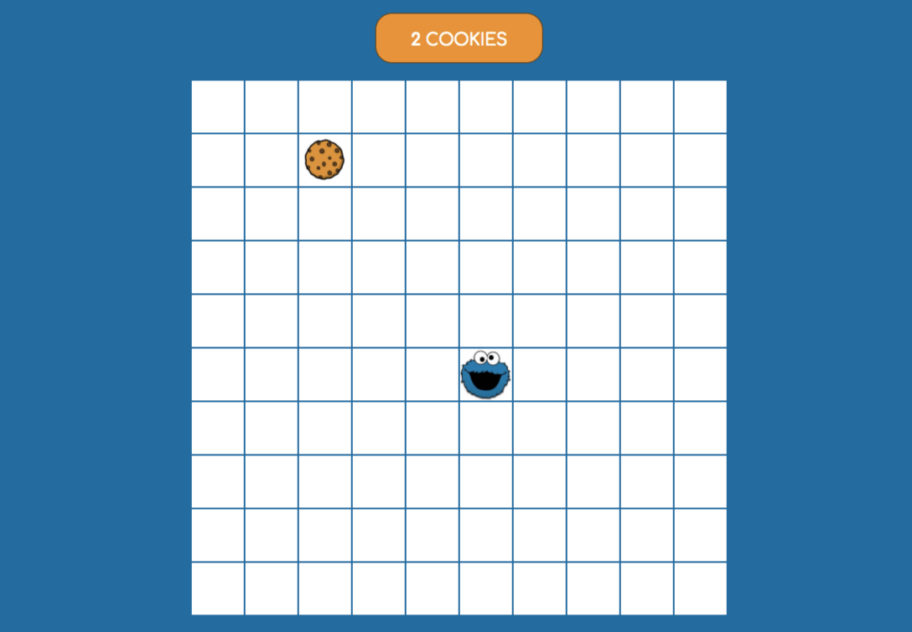

# Cookie Monster Game

Cookie Monster Game is a game written in object oriented JavaScript. The player controls the character using the keyboard arrows :arrow_left: :arrow_up: :arrow_right: :arrow_down:.

## Demo

[Cookie Monster Game - Live DEMO](https://karoczerwinska.github.io/Cookie_Monster_Game/)

## Technologies used in this project:

- HTML
- CSS
- JavaScript

## Preview:

